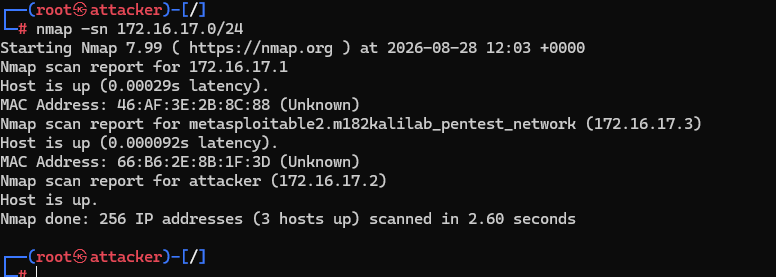
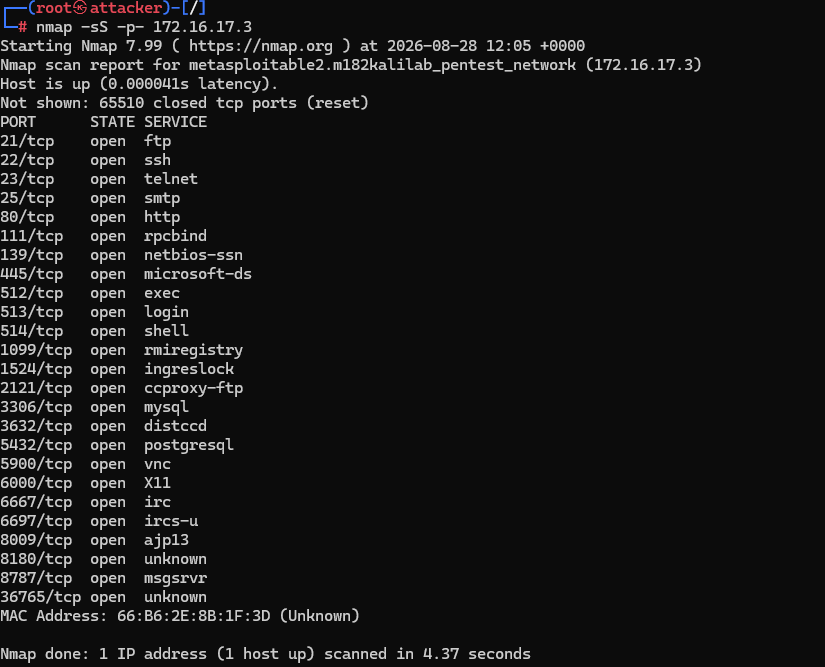
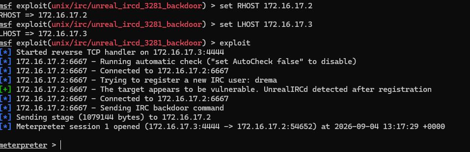

# Tag 2

# Kali linux & Metasploit

1. Nmap scan

2. Port scanning

3. Service Scan

Liste der Services

| Port / Protocol | State | Service | Version / Information |
| :--- | :--- | :--- | :--- |
| **21/tcp** | open | ftp | vsftpd 2.3.4 |
| **22/tcp** | open | ssh | OpenSSH 4.7p1 Debian 8ubuntu1 (protocol 2.0) |
| **23/tcp** | open | telnet | Linux telnetd |
| **25/tcp** | open | smtp | Postfix smtpd |
| **80/tcp** | open | http | Apache httpd 2.2.8 ((Ubuntu) DAV/2) |
| **111/tcp** | open | rpcbind | 2 (RPC #100000) |
| **139/tcp** | open | netbios-ssn | Samba smbd 3.X - 4.X (workgroup: WORKGROUP) |
| **445/tcp** | open | netbios-ssn | Samba smbd 3.X - 4.X (workgroup: WORKGROUP) |
| **512/tcp** | open | exec? | |
| **513/tcp** | open | login | |
| **514/tcp** | open | tcpwrapped | |
| **1099/tcp** | open | java-rmi | GNU Classpath grmiregistry |
| **1524/tcp** | open | ingreslock? | |
| **2121/tcp** | open | ftp | ProFTPD 1.3.1 |
| **3306/tcp** | open | mysql | MySQL 5.0.51a-3ubuntu5 |
| **5432/tcp** | open | postgresql | PostgreSQL DB 8.3.0 - 8.3.7 |
| **5900/tcp** | open | vnc | VNC (protocol 3.3) |
| **6000/tcp** | open | X11 | (access denied) |
| **6667/tcp** | open | irc | UnrealIRCd |
| **8009/tcp** | open | ajp13 | Apache Jserv (Protocol v1.3) |
| **8180/tcp** | open | http | Apache Tomcat/Coyote JSP engine 1.1 |
4.  
5. 

Exploitations
    
